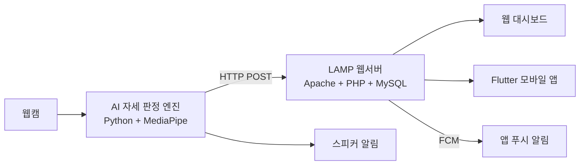

# AI 스마트 자세교정 데스크 시스템

> 웹캠 기반 AI 자세 분석 + 소리/앱 알림 + LAMP 웹 대시보드 + Flutter 모바일 앱

## 프로젝트 개요

장시간 책상에 앉아 공부하거나 작업할 때 발생하는 **거북목, 좌우 비대칭, 앞으로 기울어진 자세**를 웹캠과 AI가 실시간으로 감지하고, 소리 알림과 앱 푸시 알림으로 피드백을 제공하며, LAMP 기반 웹 대시보드와 Flutter 앱을 통해 자세 통계를 확인할 수 있는 시스템입니다.

## 시스템 구조

## 기술 스택

| 구분 | 기술 |
|------|------|
| AI / 영상처리 | Python, OpenCV, MediaPipe Pose |
| LAMP 웹서버 | Linux (Ubuntu), Apache, MySQL, PHP, Chart.js |
| 모바일 앱 | Flutter (Dart) |
| 개발 환경 | Windows + Linux VM (SSH) + VS Code Remote-SSH |

## 문서

- [상세 프로젝트 기획서 (project.md)](project.md)

## 라이선스

이 프로젝트는 MIT 라이선스를 따릅니다.
