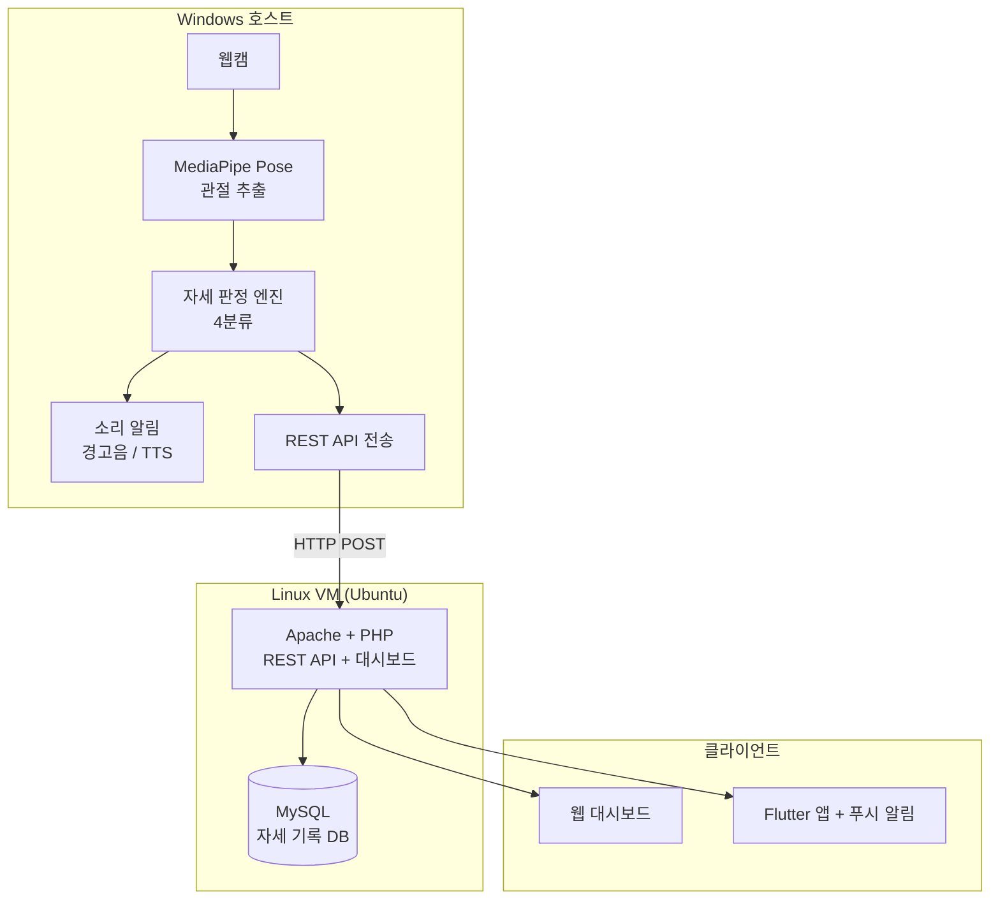
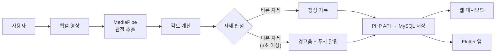
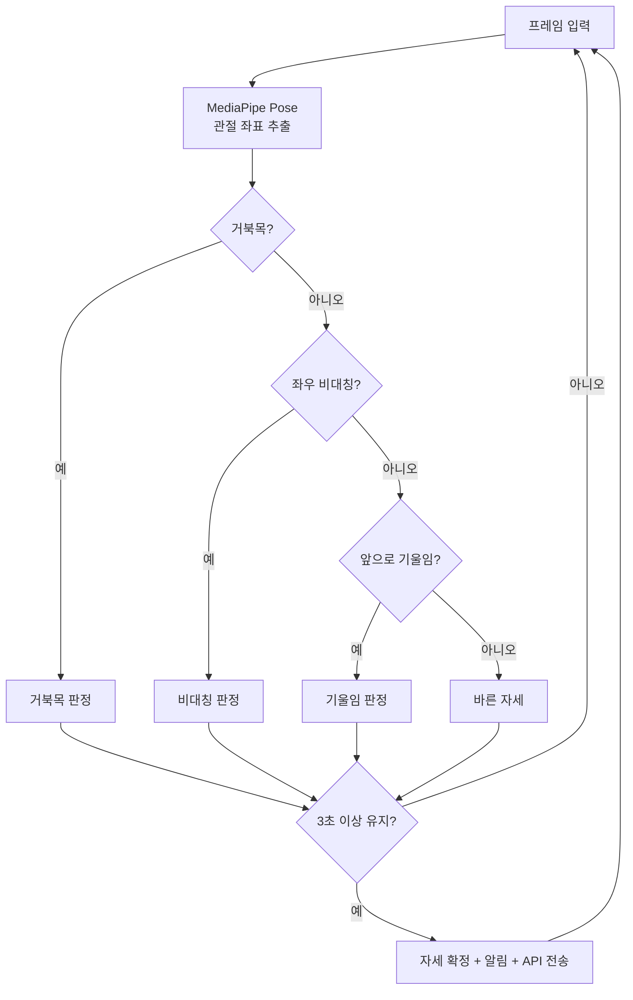
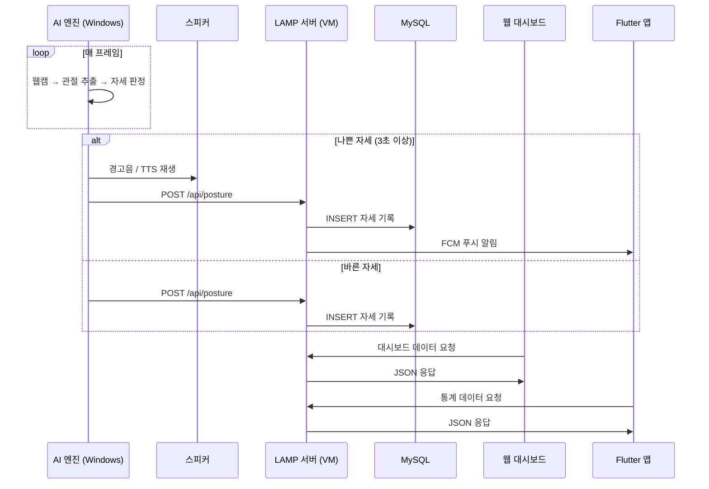
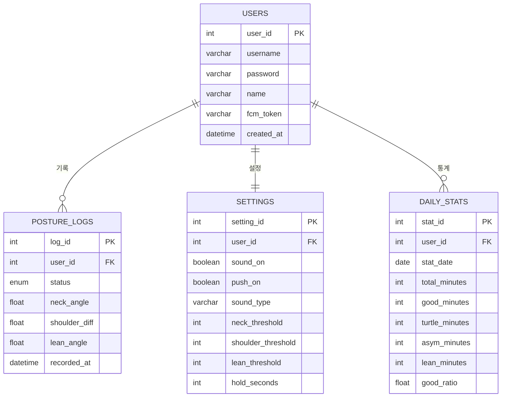

# 시스템 설계

## 1. 시스템 블록도

AI 엔진은 Windows 호스트에서 웹캠과 함께 실행하고, LAMP 서버는 Linux VM에서 구동한다. AI 엔진이 REST API로 VM의 서버에 데이터를 전송하는 구조이다.

---

## 2. 데이터 흐름도

---

## 3. 자세 판정 플로우차트

---

## 4. 시퀀스 다이어그램

---

## 5. 데이터베이스 ERD

