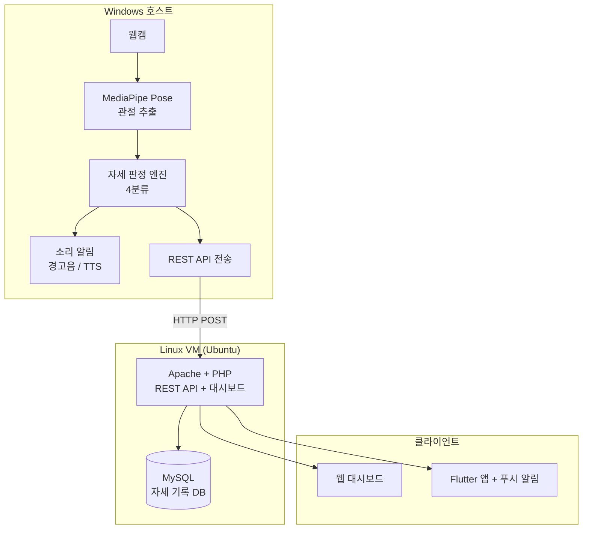
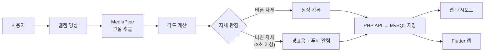
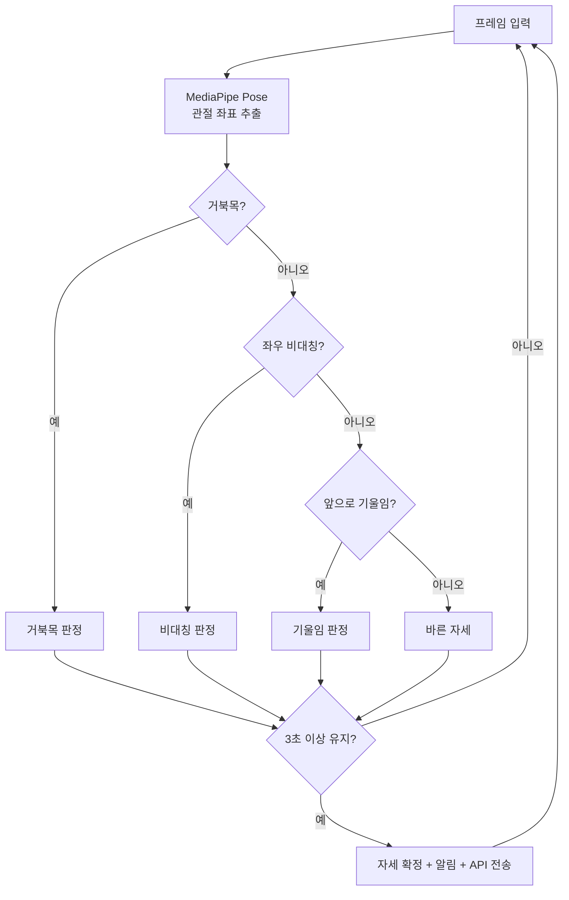
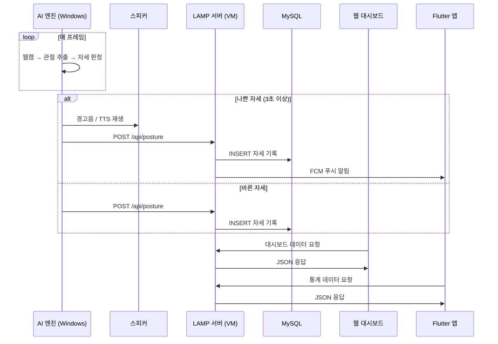
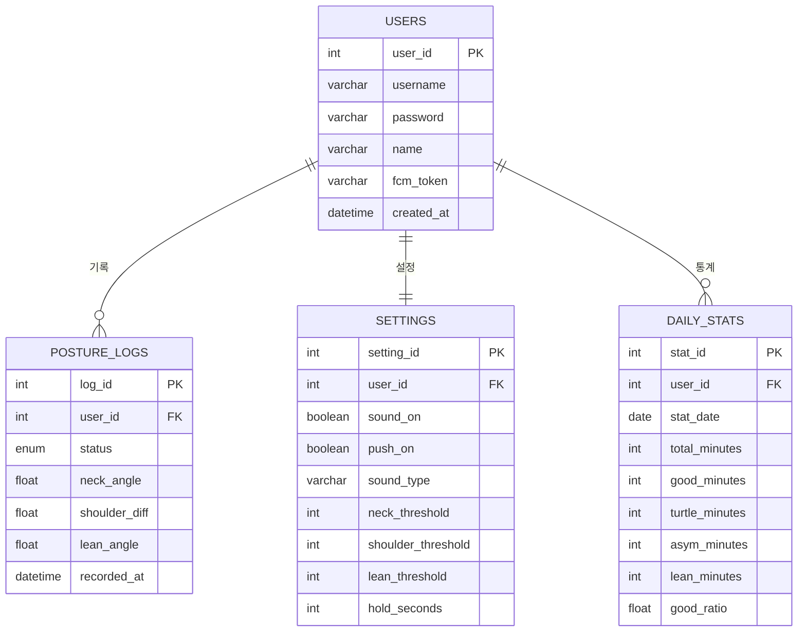

# AI 스마트 자세교정 데스크 시스템 — 프로젝트 기획서

## 1. 프로젝트 소개

### 1.1 배경 및 필요성

대학생과 직장인은 하루 평균 8시간 이상 책상에 앉아 생활한다. 장시간 앉아있는 동안 자신도 모르게 거북목, 좌우 비대칭, 앞으로 구부정한 자세가 되며, 이는 목/어깨 통증, 척추 질환, 만성 피로의 주요 원인이 된다.

기존의 자세 교정 솔루션은 다음과 같은 한계가 있다:
- **스마트폰 앱**: 사용자가 수동으로 체크해야 하며, 실시간 감지 불가
- **자세 교정 밴드/의자**: 물리적 구속감이 크고 적응이 어려움
- **웨어러블 기기 (UPRIGHT GO 등)**: 기울기만 측정, 매번 부착 필요, 세부 자세 구분 불가

본 프로젝트는 **웹캠과 AI 영상처리**만으로 자세를 자동 감지하고, **소리 알림과 앱 푸시 알림**으로 피드백을 제공하며, **LAMP 웹 대시보드**와 **Flutter 모바일 앱**으로 자세 통계를 시각화하는 시스템을 구현한다.

### 1.2 기존 솔루션 대비 차별점

| 비교 항목 | 기존 솔루션 | 본 프로젝트 |
|----------|-----------|-----------|
| 감지 방식 | 수동 촬영 or 웨어러블 부착 | 웹캠 자동 실시간 감지 (비접촉) |
| 분류 정밀도 | 거북목 1가지 or 기울기만 | 거북목 + 좌우 비대칭 + 앞으로 기울임 + 바른 자세 4분류 |
| 피드백 | 화면 알림 or 진동만 | 경고음/TTS 음성 + 앱 푸시 알림 |
| 착용 부담 | 기기 부착 필요 | 비접촉 — 부착 없음 |
| 데이터 관리 | 앱 내 간단한 기록 | LAMP 웹 대시보드 + Flutter 앱 |
| 추가 장비 | 웨어러블 별도 구매 | 웹캠만 있으면 동작 |

### 1.3 프로젝트 목표

1. MediaPipe Pose 기반 실시간 자세 감지 및 4가지 분류
2. 경고음/TTS 음성 알림 + 앱 푸시 알림 피드백
3. LAMP 스택 기반 웹 대시보드
4. Flutter 모바일 앱
5. REST API를 통한 모듈 간 통신

---

## 2. 시스템 설계

### 2.1 시스템 블록도

AI 엔진은 Windows 호스트에서 웹캠과 함께 실행하고, LAMP 서버는 Linux VM에서 구동한다. AI 엔진이 REST API로 VM의 서버에 데이터를 전송하는 구조이다.

### 2.2 데이터 흐름도

### 2.3 자세 판정 플로우차트

### 2.4 시퀀스 다이어그램

### 2.5 데이터베이스 ERD

---

## 3. 개발 환경

| 구성 | 설명 |
|------|------|
| 호스트 | Windows PC (VS Code + SSH 접속) |
| 가상머신 | Ubuntu 22.04 LTS (VirtualBox 또는 VMware) |
| 접속 방식 | VS Code Remote-SSH 확장 |
| AI 엔진 | Windows 호스트에서 실행 (웹캠 직접 접근) |
| LAMP 서버 | Linux VM 내부에서 구동 |
| Flutter | Windows 호스트에서 빌드 |

AI 엔진은 웹캠 접근이 필요하므로 Windows에서 실행하고, LAMP 서버만 VM에서 구동한다. AI → LAMP 간 HTTP 통신으로 연결되므로 깔끔하게 분리된다.

---

## 4. 기술 스택

| 구분 | 기술 |
|------|------|
| AI / 영상처리 | Python, OpenCV, MediaPipe Pose, NumPy, pyttsx3 |
| LAMP 웹서버 | Linux (Ubuntu), Apache, MySQL, PHP, Chart.js, Bootstrap |
| 모바일 앱 | Flutter (Dart) |
| 푸시 알림 | Firebase Cloud Messaging (FCM) |

---

## 5. 주요 구현 기능

### 5.1 AI 자세 판정
- MediaPipe Pose로 관절 좌표 추출
- 귀-어깨 각도, 어깨 높이 차이, 어깨-엉덩이 각도 기반 4분류
- 3초 이상 유지 시 자세 확정 (오탐 방지)

### 5.2 알림
- 경고음 또는 TTS 음성 안내 (Windows 스피커)
- FCM 기반 스마트폰 푸시 알림

### 5.3 LAMP 웹 대시보드
- 실시간 자세 상태 표시
- 일별/주별 자세 비율 통계 그래프 (Chart.js)
- 알림 설정 (소리/푸시 ON/OFF, 임계값 조절)

### 5.4 Flutter 모바일 앱
- 실시간 자세 상태 확인
- 통계 그래프 조회
- 푸시 알림 수신

---

## 6. 참고 자료

- MediaPipe Pose: https://developers.google.com/mediapipe/solutions/vision/pose_landmarker
- OpenCV: https://docs.opencv.org/
- Flutter: https://docs.flutter.dev/
- Firebase Cloud Messaging: https://firebase.google.com/docs/cloud-messaging
- Chart.js: https://www.chartjs.org/docs/
- VS Code Remote-SSH: https://code.visualstudio.com/docs/remote/ssh
